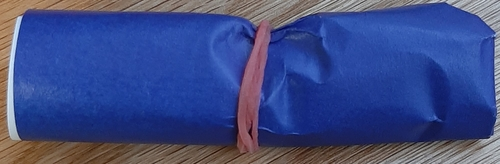

# Flick of the Wrist

### Author: Adarsh Suresh

## Dependencies

- [Visual Studio 2019](https://visualstudio.microsoft.com/downloads/)
- [OpenCV 4.2.0](https://github.com/opencv/opencv/releases/tag/4.2.0)
- [Cinder 0.9.3dev](https://github.com/cinder/Cinder/tree/master)
- Microsoft Windows 10 64 bit

## Getting Started
### Visual Studio
Download Visual Studio 2019 and make sure to check Desktop development with C++.
### Cinder
Clone the Cinder repository from their master branch. Go to `\proj\vc2019` in your cloned repository and open `cinder.sln`. This should open Cinder in Visual Studio. Open `Filesystem.h` within `Header Files` in the Solution Explorer. Change `#include <filesystem>` to `#include <experimental/filesystem>` and `std::filesystem` to `std::experimental::filesystem`. Write `#define _SILENCE_EXPERIMENTAL_FILESYSTEM_DEPRECATION_WARNING` above `#include <experimental/filesystem>`. In Visual Studio, click on `cinder` in the Solution Explorer and click `Alt + Enter` to open up the properties of the solution. Go to `Configuration Properties` -> `C/C++` -> `All Options` and scroll to `Runtime Library`. Change the value of `Runtime Library` to `Multi-threaded Debug DLL (/MDd)`. Next, click on `Solution 'cinder'` in the Solution Explorer and click `Alt + Enter` and go to `Configuration Properties` -> `Configuration`. The configuration should be `Debug`, platform should be `x64`, and `Build` should be checked. Next, you can build Cinder by clicking on the green play button at the top of Visual Studio. Finally, within your Cinder root directory, create a `my-projects` directory.
### OpenCV 4.2.0
Go to the OpenCV 4.2.0 Release on GitHub. Download the `opencv-4.2.0-vc14_vc15.exe` file and extract it.
### Flick of the Wrist
Clone this repository into your `my-projects` directory. Open the `.sln` file which will open Visual Studio. Click on `final-project` in the Solution Explorer and click `Alt + Enter`. Go to `Configuration Properties` -> `C/C++` -> `General` -> `Additional Include Directories` -> `Edit` and change the path of the OpenCV `include` directory to the corresponding path on your system. Next, go to `Configuration Properties` -> `Linker` -> `General` -> `Additional Library Directories` -> `Edit` and change the path of the OpenCV `lib` directory to the corresponding path on your system. Build the project and you should get an error about a missing `opencv_world420d.dll` file. Go to `opencv\build\x64\vc15\bin` to find `opencv_world420d.dll` and copy that file into the `final-project-18suresha\x64\Debug` directory. Now, you should be able to build successfully.
## How to Use
Make sure that no other application is using your primary camera. Once you run the project and the GUI opens, click on `Actions` -> `Display Sections`. This will open a window showing you the video from the front facing camera split into sections by black lines. The middle section is called the neutral zone. While your finger is in this section, no keyboard or mouse action will be performed. The neutral zone should preferably surround your head. Press `q` to exit the window.
### Movements and Actions
There are four sections with respect to the neutral zone. The section right above, right below it, directly to the right, and directly to the left of the neutral zone. Finger movement will be tracked only in these four sections. These sections can be viewed by clicking on `Display Sections`.

| Finger Movement       | Window Action                                               |
|-----------------------|-------------------------------------------------------------|
| Up                    | Scroll Up                                                   |
| Down                  | Scroll Down                                                 |
| Right                 | Switch Tabs Right                                           |
| Left                  | Switch Tabs Left                                            |

### Physical Dependencies
Something that can cover a good amount of your finger and is either fully blue, red, or pink. Like the examples below.

Place something like this on your finger.
### Calibration
If you change colors or the dimensions of your neutral zone, make sure to place your finger in the neutral zone and click `Actions` -> `Calibrate`. This might take a few seconds.
### Running Flick of the Wrist
Once you choose your color and calibrate, you can click `Actions` -> `Run` and then switch to another winder such as Google Chrome to start using the application by moving your finger.

## Notes

- This might work on Visual Studio 2015, but it has not been tested.
- This might work with previous versions of OpenCV, but it has not been tested.
- This might work with previous Versions of Windows 64 bit, but it has not been tested.

---

